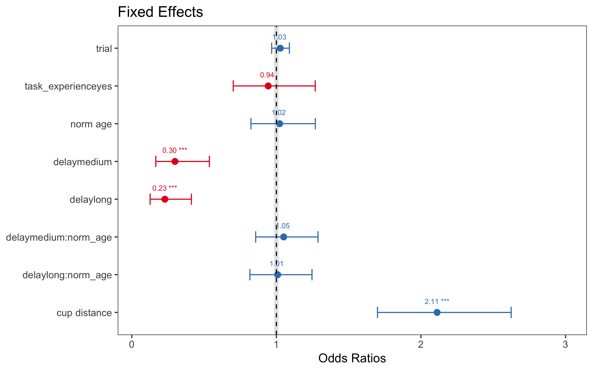

```{r setup, message=FALSE}
library(tidyverse)
library(lme4)
library(emmeans)
library(car) # for vif
library(sjPlot)
library(broom)
library(knitr)

theme_set(ggthemes::theme_few())
```

# Summary

Mixed modeling with all relevant variables predicting accuracy

From the preregistration, the mixed model was specified thusly:

```
correct ~ delay * age + 
          task_experience + cup_distance + board_size + trial +
          (1 + delay + trial | site/subject/block/hiding_location ) + 
          (1 + task_experience + cup_distance + board_size + trial + delay | species)
```

In the dataframe, 
`subject_site = subject`,
and `norm_age` should be used for `age`.

Model as pre-registered has too many random effects

```
Error: number of observations (=6246) < number of random effects (=10608) for term (1 + delay + trial | hiding_location:(block:(subject_site:site))); the random-effects parameters are probably unidentifiable
```

Pruning random effects in the following order (from preregistration): 

> - Remove correlations between random effects
> - Remove random slopes (in the following order)
>     - `species`
>     - `hiding_location`
>     - `block`
>     - `subject`

Model only converges once we take out `hiding_location`. After doing so, the other random effects (correlation, site, species) can be put back in.

The model below converges. Model output is saved in `06_mp_model_v2.rds`

```
correct ~ delay * norm_age + 
          task_experience + cup_distance + board_size + trial + 
          (1 + delay + trial | site/subject_site/block) + 
          (1 + task_experience + cup_distance + board_size + trial + delay | species)
```

## Reduced model

After pruning random effects with little variability and removing `board_size`, which covaried with `cup_distance`, the reduced model has the following structure. It is saved in `06_mp_3_model3_v2.rds`

```
correct ~ delay * norm_age + 
          task_experience + cup_distance + trial + 
          (1 + delay | site/subject_site) + 
          (1 + delay | species)
```



***

# Data prep

Data import

```{r loading data}
mp_data <- read.csv("../data/merged_data/01_manyprimates_pilot_merged_data_v2.csv")
```

Prepare code for pre-registered mixed modeling

- center `cup_distance`, `board_size` and `trial`
- filter out spider monkey. Only one data point so far, therefore this is not worth including to explode the number of random effects

```{r}
model.data <- mp_data %>%
  filter(species != "black_faced_spider_monkey") %>%
  mutate_at(vars(cup_distance, board_size, trial), funs(scale(.)[,1])) %>%
  mutate(hiding_location = factor(hiding_location),
         delay = fct_relevel(delay, "short"))
```

# Model 1

The model takes a while to run. Run next line to load model output from previous run with structure below.

```{r}
# mm.1 <- readRDS("06_mp_model.rds")
mm.1 <- readRDS("06_mp_model_v2.rds")
```

```{r, eval=FALSE}
mm.1 = glmer(correct ~ delay * norm_age + 
               task_experience + cup_distance + board_size + trial +
               (1 + delay + trial | site/subject_site/block) + 
               (1 + task_experience + cup_distance + board_size + trial + delay | species)
             , data = model.data
             , family = binomial
             , control = glmerControl(optimizer = "bobyqa", optCtrl = list(maxfun = 2e5))
             )

saveRDS(mm.1, "06_mp_model_v2.rds")
```

Some diagnostics

- examining Cholesky decomposition

```{r}
theta <- getME(mm.1, "theta")
diag.element <- getME(mm.1, "lower") == 0
any(theta[diag.element] < 1e-5)
```

## Model summary

Confirm model structure

```{r}
# mm.1@call
formula(mm.1)
```

```{r, results='asis'}
glance(mm.1) %>% kable(digits = 2)
```

## Random effects

```{r}
fmt = function(num, digits) return(round(num, digits))
VarCorr(mm.1) %>% print(formatter = fmt, digits = 3) # comp = c("Variance", "Std.Dev.")
```

## Fixed effects

CIs

```{r}
mm.1.ci = confint(mm.1, method = 'Wald') %>% # bootstrap these later
  as.data.frame %>% 
  rownames_to_column %>% 
  filter(complete.cases(.)) %>% 
  rename(LL = `2.5 %`, UL = `97.5 %`) %>%
  mutate(OR_LL = exp(LL), OR_UL = exp(UL))
```

```{r, results='asis'}
coef(summary(mm.1)) %>% 
  as.data.frame %>% 
  rownames_to_column() %>%
  mutate(OR = exp(Estimate)) %>%
  left_join(mm.1.ci, by = 'rowname') %>%
  select(rowname, OR, OR_LL, OR_UL, Estimate, LL, UL, everything()) %>%
  kable(digits = 3)
```

<!-- ## Correlation of Fixed Effects -->

```{r, eval=FALSE, results='asis'}
corr = cov2cor(vcov(mm.1)) %>% as.matrix %>% round(2)
corr[upper.tri(corr, diag = T)] = ''
colnames(corr) = 1:10
rownames(corr) = str_c(1:10, ' ', rownames(corr))

corr %>% as.data.frame %>% select(-10) %>% rownames_to_column
```

## Pairwise contrasts for delay

based on estimated marginal means

*Note. This wasn't in the preregistration but, of course, yields the same conclusion as specifying another model with, say, 'medium' as the reference level or running another model that excludes 'short'. And it's a more elegant approach in my opinion. Thoughts? --jw*

```{r, message=FALSE}
emmeans(mm.1, pairwise ~ delay, type = 'response')$contrasts
```

# Model 1 plots

## Fixed effects

```{r, fig.width=4, fig.height=2.5, message=FALSE}
plot_model(mm.1, title = 'Fixed Effects', order.terms = c(7, 4, 3:1, 9:8, 5, 6), width = .3,
           show.values = T, value.size = 2.5, value.offset = .3) +
  geom_hline(yintercept = 1, lty = 2) +
  ylim(0, 3)
```

## Random effects

```{r}
ranef.plots = plot_model(mm.1, type = 're', sort.est = '(Intercept)')
```

### Block/Subject/Site

In line with the model summary above, there's essentially zero variability in the random effects estimates for this.

```{r fig.height=20, fig.width=10}
ranef.plots[[1]]
```

### Subject/Site

```{r, fig.width=10, fig.height=8}
ranef.plots[[2]]
```

### Site

```{r, fig.width=10, fig.height=3}
ranef.plots[[3]]
```

### Species

```{r ranef species, fig.width=8, fig.height=2}
ranef.plots[[4]]
```

***

# Pruning the model

- remove `block` from random effects as the estimates in the previous models were essentially 0
- same for `trial` random slopes within `species`

```
correct ~ delay * norm_age + 
          task_experience + cup_distance + board_size + trial +
          (1 + delay + trial | site/subject_site ) +         
          (1 + task_experience + cup_distance + board_size + delay | species)
```

## Check colinearity in the previous model

```{r}
col.mm1 <- glm(correct ~ delay + norm_age + 
                 task_experience + cup_distance + board_size + trial
               , data = model.data
               , family = binomial)

vif(col.mm1)
```

`board_size` and `cup_distance` show high colinearity

Remove `board_size` as it is highly correlated with `cup_distance`. Cup distance seems to be of more immediate relevance.

```
correct ~ delay * norm_age + 
          task_experience + cup_distance + trial +
          (1 + delay + trial | site/subject_site ) +         
          (1 + task_experience + cup_distance + delay | species)
```

## Check levels of random effects

Check how many different levels there are within each random effect

```{r}
source("diagnostic_fcns.r") 

Overview = fe.re.tab("correct ~ delay + task_experience + cup_distance + trial", "species", data = model.data)

Overview$summary
```

This suggests that, within species, random slopes for `task_experience` does not make much sense as most species have only 1 level. Same is true for `cup_distance`. Indeed, the model summary and random effects plot for `species` confirm that there is little variability in these estimates (they're close to zero). Therefore they are removed.

```
correct ~ delay * norm_age + 
          task_experience + cup_distance + trial +
          (1 + delay + trial | site/subject_site ) +         
          (1 + delay | species)
```

# Model 2

The model takes a while to run. Run next line to load model output from previous run with structure below.

```{r}
mm.2 <- readRDS("06_2_mp_model2_v2.rds")
# mm.2.ci<- readRDS("06_2_mp_model2_ci_v2.rds")
```

```{r, eval=FALSE}
mm.2 <- glmer(correct ~ delay * norm_age +
              task_experience + cup_distance +  trial +
              (1 + trial + delay | site / subject_site ) +         
              (1 + delay | species)
              , data = model.data
              , family = binomial
              , control = glmerControl(optimizer = "bobyqa", optCtrl = list(maxfun = 2e5))
              )

saveRDS(mm.2, "06_2_mp_model2_v2.rds")
```

# Model 3

*I would argue to also remove `trial` from the random slopes for subject/species as it's near zero both in `mm.1` and even more so in `mm.2`. I've done so below, in `mm.3`. Thoughts? --jw*

```{r}
VarCorr(mm.2) %>% print(comp = c("Variance", "Std.Dev."), formatter = fmt, digits = 3)
```

```{r, fig.width=10, fig.height=8}
plot_model(mm.2, type = 're', sort.est = '(Intercept)')[[1]]
```

```{r, fig.width=10, fig.height=3}
plot_model(mm.2, type = 're', sort.est = '(Intercept)')[[2]]
```

The model takes a while to run. Run next line to load model output from previous run with structure below.

```{r}
mm.3 <- readRDS("06_3_mp_model3_v2.rds")
```

```{r, eval=FALSE}
mm.3 <- glmer(correct ~ delay * norm_age +
              task_experience + cup_distance +  trial +
              (1 + delay | site / subject_site ) +         
              (1 + delay | species)
              , data = model.data
              , family = binomial
              , control = glmerControl(optimizer = "bobyqa", optCtrl = list(maxfun = 2e5))
              )

saveRDS(mm.4, "06_3_mp_model3_v2.rds")
```

## Model summary

Confirm model structure

```{r}
formula(mm.3)
```

```{r, results='asis'}
glance(mm.3) %>% kable(digits = 2)
```

## Random effects

```{r}
VarCorr(mm.3) %>% print(comp = c("Variance", "Std.Dev."), formatter = fmt, digits = 3)
```

## Fixed effects

CIs

<!-- Bootstrap function by Roger Mundry @ MPI EVA -->

```{r, eval=FALSE}
# this is not currently run
source("boot_glmm.r")

mm.3.ci = boot.glmm.pred(model.res=mm.3, excl.warnings=F, nboots=1000, para=F, resol=100, level=0.95, use=NULL, circ.var.name=NULL, circ.var=NULL, use.u=F,n.cores=c("all-1", "all"), save.path=NULL)

saveRDS(mm.2.ci, "06_2_mp_model2_ci_v2.rds")
```

```{r}
mm.3.ci = confint(mm.3, method = 'Wald') %>% # bootstrap these later
  as.data.frame %>% 
  rownames_to_column %>% 
  filter(complete.cases(.)) %>% 
  rename(LL = `2.5 %`, UL = `97.5 %`) %>%
  mutate(OR_LL = exp(LL), OR_UL = exp(UL))
```

```{r, results='asis'}
coef(summary(mm.3)) %>% 
  as.data.frame %>% 
  rownames_to_column() %>%
  mutate(OR = exp(Estimate)) %>%
  left_join(mm.3.ci, by = 'rowname') %>%
  select(rowname, OR, OR_LL, OR_UL, Estimate, LL, UL, everything()) %>%
  kable(digits = 3)
```

## Pairwise contrasts for delay

based on estimated marginal means

```{r, message=FALSE}
emmeans(mm.3, pairwise ~ delay, type = 'response')$contrasts
```

# Model 3 plots

## Fixed effects

```{r, fig.width=4, fig.height=2.5, message=FALSE}
plot_model(mm.3, title = "Fixed Effects", order.terms = c(6, 4, 3:1, 8:7, 5), width = .3,
           show.values = T, value.size = 2.5, value.offset = .3) +
  geom_hline(yintercept = 1, lty = 2) +
  ylim(.05, 3)
```

```{r}
ggsave('../graphs/07_forestplot.png', width = 4, height = 2.5, scale = 2)
```

## Random effects

```{r}
ranef.plots2 = plot_model(mm.3, type = 're', sort.est = '(Intercept)')
```

### Subject/Site

```{r, fig.width=10, fig.height=8}
ranef.plots2[[1]]
```

### Site

```{r, fig.width=10, fig.height=3}
ranef.plots2[[2]]
```

### Species

```{r, fig.width=4, fig.height=2}
ranef.plots2[[3]]
```

# Model 4

- further remove subject/site random effects

*Note. I'm not sure why this is here. It runs fast and is simpler but it's also worse than the less reduced model/s (mm.2/3) and also worse than the full(ish) model (mm.1); see below. --jw*

```{r}
mm.4 <- glmer(correct ~ delay * norm_age +
                task_experience + cup_distance + trial +
                (1 + delay | species)
              , data = model.data
              , family = binomial
              , control = glmerControl(optimizer = "bobyqa", optCtrl = list(maxfun = 2e5))
        )
```

# Model comparison

We're looking for the lowest AIC(c) as the model with the 'best fit' with a reasonable number of parameters. (Too many are penalized by AIC as one way to address overfitting.)

Indeed, the reduced model seems to do a better job of striking that balance between fitting the data with fewer parameters.

```{r}
bbmle::AICctab(mm.1, mm.2, mm.3, mm.4)
```

```{r}
anova(mm.1, mm.2, mm.3, mm.4)
```

## Difference in regression coefficients

Difference

```{r}
coef1 = coef(summary(mm.1))[c(2,3,6), 1]
coef2 = coef(summary(mm.3))[c(2,3,6), 1]

coef2 - coef1
```

Difference in odds ratios

```{r}
exp(coef2) - exp(coef1)
```

