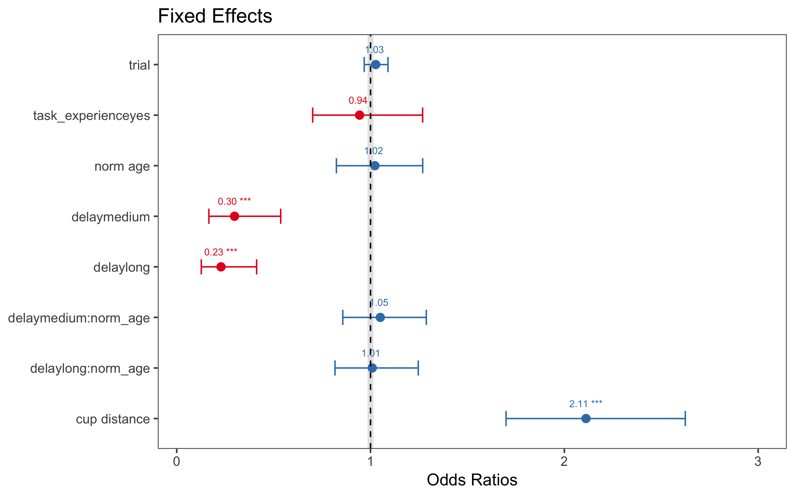

```{r setup, message=FALSE}
library(tidyverse)
library(knitr)
library(sjPlot)
library(viridis)
library(colorblindr)
library(gridExtra)
library(ggpubr) # for ggarrange
library(lme4)
library(emmeans)
library(car) # for vif
library(bbmle) # for AICtab
library(broom) # for glance

theme_set(ggthemes::theme_few())
```

# Summary

Mixed modeling with all relevant variables predicting accuracy

From the preregistration, the mixed model was specified thusly:

```
correct ~ delay * age + 
          task_experience + cup_distance + board_size + trial +
          (1 + delay + trial | site/subject/block/hiding_location ) + 
          (1 + task_experience + cup_distance + board_size + trial + delay | species)
```

In the dataframe, 
`subject_site = subject`,
and `norm_age` should be used for `age`.

Model as pre-registered has too many random effects

```
Error: number of observations (=6246) < number of random effects (=10608) for term (1 + delay + trial | hiding_location:(block:(subject_site:site))); the random-effects parameters are probably unidentifiable
```

Pruning random effects in the following order (from preregistration): 

> - Remove correlations between random effects
> - Remove random slopes (in the following order)
>     - `species`
>     - `hiding_location`
>     - `block`
>     - `subject`

Model only converges once we take out `hiding_location`. After doing so, the other random effects (correlation, site, species) can be put back in.

The model below converges. Model output is saved in `06_mp_model_v2.rds`

```
correct ~ delay * norm_age + 
          task_experience + cup_distance + board_size + trial + 
          (1 + delay + trial | site/subject_site) + 
          (1 + task_experience + cup_distance + board_size + trial + delay | species)
```

## Reduced model

After pruning random effects with little variability and removing `board_size`, which covaried with `cup_distance`, the reduced model has the following structure. It is saved in `06_mp_3_model3_v2.rds`

```
correct ~ delay * norm_age + 
          task_experience + cup_distance + board_size + trial + 
          (1 + delay | site/subject_site) + 
          (1 + delay | species)
```



***

# Data prep

Data import

```{r loading data}
mp_data <- read.csv("../data/merged_data/01_manyprimates_pilot_merged_data_v2.csv")
```

Prepare code for pre-registered mixed modeling

- center `cup_distance`, `board_size` and `trial`
- filter out spider monkey. Only one data point so far, therefore this is not worth including to explode the number of random effects

```{r}
model.data <- mp_data %>%
  filter(species != "black_faced_spider_monkey") %>%
  mutate_at(vars(cup_distance, board_size, trial), funs(scale(.)[, 1])) %>%
  mutate(hiding_location = factor(hiding_location),
         delay = fct_relevel(delay, "short"))
```

# Model 1

The model takes a while to run. Run next line to load model output from previous run with structure below.

```{r}
mm.1 <- readRDS("06_mp_model1.rds")
```

```{r, eval=FALSE}
mm.1 <- glmer(correct ~ delay * norm_age +
               task_experience + cup_distance + board_size + trial +
               (1 + delay + trial | site/subject_site/block) +
               (1 + task_experience + cup_distance + board_size + trial + delay | species)
             , data = model.data
             , family = binomial
             , control = glmerControl(optimizer = "bobyqa", optCtrl = list(maxfun = 2e5))
             )

saveRDS(mm.1, "06_mp_model1.rds")
```

Some diagnostics

- examining Cholesky decomposition

```{r}
theta <- getME(mm.1, "theta")
diag.element <- getME(mm.1, "lower") == 0
any(theta[diag.element] < 1e-5)
```

## Model summary

Confirm model structure

```{r}
# mm.1@call
formula(mm.1)
```

```{r, results="asis"}
glance(mm.1) %>% kable(digits = 2)
```

## Random effects

```{r}
fmt <- function(num, digits) return(round(num, digits))
VarCorr(mm.1) %>% print(formatter = fmt, digits = 3) # comp = c("Variance", "Std.Dev.")
```

## Fixed effects

CIs

```{r}
mm.1.ci <- confint(mm.1, method = "Wald") %>% # bootstrap these later
  as.data.frame %>%
  rownames_to_column %>%
  filter(complete.cases(.)) %>%
  rename(LL = `2.5 %`, UL = `97.5 %`) %>%
  mutate(OR_LL = exp(LL), OR_UL = exp(UL))
```

```{r, results="asis"}
coef(summary(mm.1)) %>%
  as.data.frame %>%
  rownames_to_column() %>%
  mutate(OR = exp(Estimate)) %>%
  left_join(mm.1.ci, by = "rowname") %>%
  select(rowname, OR, OR_LL, OR_UL, Estimate, LL, UL, everything()) %>%
  kable(digits = 3)
```

<!-- ## Correlation of Fixed Effects -->

```{r, eval=FALSE, results="asis"}
corr <- cov2cor(vcov(mm.1)) %>% as.matrix %>% round(2)
corr[upper.tri(corr, diag = T)] <- ""
colnames(corr) <- 1:10
rownames(corr) <- str_c(1:10, " ", rownames(corr))

corr %>% as.data.frame %>% select(-10) %>% rownames_to_column
```

## Pairwise contrasts for delay

based on estimated marginal means

*Note. This wasn't in the preregistration.*

```{r, message=FALSE}
emmeans(mm.1, pairwise ~ delay, type = "response")$contrasts
```

# Model 1 plots

## Fixed effects

```{r, fig.width=4, fig.height=2.5, message=FALSE}
plot_model(mm.1, title = "Fixed Effects", order.terms = c(7, 4, 3:1, 9:8, 5, 6),
           width = .3, show.values = T, value.size = 2.5, value.offset = .3) +
  geom_hline(yintercept = 1, lty = 2) +
  ylim(0, 3)
```

## Random effects

```{r}
ranef.plots <- plot_model(mm.1, type = "re", sort.est = "(Intercept)")
```

### Subject/Site

```{r fig.height=20, fig.width=10}
ranef.plots[[1]]
```

### Site

```{r, fig.width=10, fig.height=8}
ranef.plots[[2]]
```

### Species

```{r, fig.width=10, fig.height=3}
ranef.plots[[3]]
```

***

# Pruning the model

- remove `trial` random slopes within `species` as the estimates in the previous models were essentially 0
- remove `trial` from the random slopes for `subject/site` for the same reason

```
correct ~ delay * norm_age + 
          task_experience + cup_distance + board_size + trial +
          (1 + delay | site/subject_site ) +         
          (1 + task_experience + cup_distance + board_size + delay | species)
```

## Check colinearity in the previous model

```{r}
col.mm1 <- glm(correct ~ delay + norm_age +
                 task_experience + cup_distance + board_size + trial
               , data = model.data
               , family = binomial)

vif(col.mm1)
```

No signs of high colinearity.

## Check levels of random effects

Check how many different levels there are within each random effect

```{r}
source("diagnostic_fcns.r")

overview <- fe.re.tab("correct ~ delay + task_experience + board_size + cup_distance + trial", "species", data = model.data)

overview$summary
```

This suggests that, within species, random slopes for `task_experience` does not make much sense as most species have only 1 level. Same is true for `cup_distance` and `board_size`. Indeed, the model summary and random effects plot for `species` confirm that there is little variability in these estimates (they're close to zero). Therefore they are removed.

```
correct ~ delay * norm_age + 
          task_experience + cup_distance + board_size + trial +
          (1 + delay + trial | site/subject_site ) +         
          (1 + delay | species)
```

# Model 2

```{r}
mm.2 <- readRDS("06_mp_model2.rds")
```

```{r, eval=FALSE}
mm.2 <- glmer(correct ~ delay * norm_age +
              task_experience + cup_distance + board_size  + trial +
              (1 + delay | site/subject_site) +
              (1 + delay | species)
              , data = model.data
              , family = binomial
              , control = glmerControl(optimizer = "bobyqa", optCtrl = list(maxfun = 2e5))
              )

saveRDS(mm.2, "06_mp_model2.rds")
```

## Model summary

Confirm model structure

```{r}
formula(mm.2)
```

```{r, results="asis"}
glance(mm.2) %>% kable(digits = 2)
```

## LRT

```{r, eval=FALSE}
drop1(mm.2, test = 'Chisq')
```

```
Single term deletions

Model:
correct ~ delay * norm_age + task_experience + cup_distance + 
    board_size + trial + (1 + delay | site/subject_site) + (1 + 
    delay | species)
                Df    AIC     LRT   Pr(Chi)    
<none>             6838.5                      
task_experience  1 6836.5  0.0074 0.9314327    
cup_distance     1 6848.6 12.0934 0.0005060 ***
board_size       1 6847.9 11.3967 0.0007357 ***
trial            1 6837.1  0.5912 0.4419742    
delay:norm_age   2 6835.3  0.8225 0.6628194    
---
Signif. codes:  0 ‘***’ 0.001 ‘**’ 0.01 ‘*’ 0.05 ‘.’ 0.1 ‘ ’ 1
```


## Random effects

```{r}
VarCorr(mm.2) %>% print(comp = c("Variance", "Std.Dev."), formatter = fmt, digits = 3)
```

## Fixed effects

CIs

```{r}
mm.2.ci <- readRDS("06_mp_model2_ci.rds")
```

```{r, eval=FALSE}
# Bootstrap function by Roger Mundry @ MPI EVA
source("boot_glmm.r")

mm.2.ci <- boot.glmm.pred(model.res = mm.2, excl.warnings = F, nboots = 1000,
                         para = F, resol = 100, level = 0.95, use = NULL,
                         circ.var.name = NULL, circ.var = NULL, use.u = F,
                         n.cores = c("all-1", "all"), save.path = NULL)

saveRDS(mm.2.ci, "06_mp_model2_ci.rds")
```

```{r, results="asis"}
coef(summary(mm.2)) %>%
  as.data.frame %>%
  rownames_to_column() %>%
  mutate(OR = exp(Estimate)) %>%
  cbind(mm.2.ci$ci.estimates[, 2:3]) %>%
  select(rowname, OR, Estimate, X2.5., X97.5., everything()) %>%
  kable(digits = 3)
```

## Pairwise contrasts for delay

based on estimated marginal means

```{r, message=FALSE}
emmeans(mm.2, pairwise ~ delay)$contrasts
```

code to bootstrap these CIs (`confint(emmeans(...)` gets Wald CIs)

```{r}
boot.pairs <- function(m) suppressMessages(summary(pairs(emmeans(m, "delay")))$estimate)

boot.emm <- function(m, n = 1000) {
  boo <- bootMer(m, FUN = boot.pairs, nsim = n, parallel = "multicore", ncpus = 4)
  ci <- sapply(1:3, function(j) quantile(boo$t[,j], prob = c(.025, .975), na.rm = T))
  ci <- t(rbind(boo$t0, ci))
  rownames(ci) <- c("short vs. long", "short vs. medium", "medium vs. long")

  return(ci)
}
```

This took ~13 hours to run on 4 cores on my machine (jw). Skip this chunk and run the next one to load CIs from previous run.

```{r, eval=FALSE}
system.time(mm2.emm.ci <- boot.emm(mm.2, n = 1000))
saveRDS(mm2.emm.ci, "06_mp_model2_emm_ci.rds")
```

```
      user     system    elapsed 
130648.652   1127.768  47989.548
```

```{r}
mm2.emm.ci <- readRDS("06_mp_model2_emm_ci.rds")
round(mm2.emm.ci, 2)
```

odds ratios

```{r}
round(exp(mm2.emm.ci), 2)
```

# Model 2 plots

## Fixed effects

```{r}
cols = viridis(7)[c(1, 5)]
```

```{r, fig.width=4, fig.height=2.5, message=FALSE}
fe.2 <- plot_model(mm.2, title = "A. Fixed Effects", 
                   axis.labels = c("Trial", "Task Experience (yes)","Board Size (cm)", 
                                   "Cup Distance (cm)", "Normed Age x Delay\n(0 vs. 30 seconds)",
                                   "Normed Age x Delay\n(0 vs. 15 seconds)", "Normed Age", 
                                   "Delay (0 vs. 30 seconds)", "Delay (0 vs. 15 seconds)"), 
                   order.terms = c(2:1, 3, 9:8, 5, 6, 4, 7), wrap.labels = F,
                   width = .3, show.values = T, value.size = 2.5, value.offset = .3, colors = cols) +
  facet_wrap(~ "") +
  # geom_hline(yintercept = 1, lty = 2) +
  scale_y_continuous(trans = "log", limits = c(.1, 5.5), breaks = c(.1, .2, .5, 1, 2, 5))

fe.2 + theme(plot.margin = unit(c(.5, 7, .5, .5), "cm"))
```

```{r, eval = FALSE}
ggsave("../graphs/05_forestplot.png", fe.2, width = 3, height = 2.5, scale = 2)
```

```{r, fig.width=8, fig.height=5}
cvd_grid(fe.2)
```

## Random effects

```{r}
ranef.plots2 <- plot_model(mm.2, type = "re", sort.est = "(Intercept)")
```

### Subject/Site

```{r, fig.width=10, fig.height=8}
ranef.plots2[[1]]
```

### Site

```{r, fig.width=10, fig.height=3}
ranef.plots2[[2]]
```

### Species

```{r, fig.width=4, fig.height=2}
ranef.plots2[[3]]
```

# Model 3

- further remove subject/site random effects to look at species differences (from preregistration)

```{r}
mm.3 <- glmer(correct ~ delay * norm_age +
                task_experience + cup_distance + trial +
                (1 + delay | species)
              , data = model.data
              , family = binomial
              , control = glmerControl(optimizer = "bobyqa", optCtrl = list(maxfun = 2e5))
        )
```

## Random effects

```{r, message=FALSE}
phylo <- read_csv("../data/species_data.csv") %>% select(species, species_formatted, phylo)
```

```{r}
plot.data <- get_model_data(mm.3, type = "re", show.values = T) %>%
  left_join(phylo, by = c("term" = "species")) %>%
  rename(species = species_formatted) %>%
  mutate(
    facet = fct_rev(facet),
    facet = fct_recode(facet, "Intercept" = "species (Intercept)",
                       "Delay (short vs. long)" = "delaylong", 
                       "Delay (short vs. medium)" = "delaymedium")
    )

sorted <- filter(plot.data, facet == "Intercept") %>% arrange(estimate) %>% with(species)
plot.data <- mutate(plot.data, species = factor(species, levels = sorted))
```

```{r, fig.width=6, fig.height=2.5}
re.3 <- ggplot(plot.data, aes(x = species, y = estimate, col = group)) +
  facet_grid(~ facet) +
  geom_hline(yintercept = 1, col = "grey90", size = 1.125) +
  # geom_hline(yintercept = 1, lty = 2) +
  geom_errorbar(aes(ymin = conf.low, ymax = conf.high), width = .3) +
  geom_point(size = 2.5) +
  geom_text(aes(label = p.label), nudge_x = .3, size = 2.5, show.legend = F) +
  scale_y_continuous("Odds Ratios", trans = "log", breaks = c(.1, .2, .5, 1, 2, 5,10,20,40)) +
  scale_colour_manual(values = cols) +
  coord_flip(ylim = c(.1, 42.5)) + xlab("") +
  guides(col = "none") +
  ggtitle("B. Species Random Effects")
```

```{r, fig.width=8, fig.height=3}
ggarrange(fe.2, re.3, widths = c(3, 7))
```

```{r, warning=FALSE}
ggsave("../graphs/05_forestplot_fe_re.png", arrangeGrob(fe.2, re.3, layout_matrix = mat), width = 8, height = 3, scale = 1.8)

ggsave("../graphs/Fig3.tiff", arrangeGrob(fe.2, re.3, layout_matrix = mat), width = 8, height = 3, scale = 1.8, type = "cairo", compression = "lzw")
```

```{r, fig.width=16, fig.height=6}
cvd_grid()
```


# Model comparison

We're looking for the lowest AIC(c) as the model with the 'best fit' with a reasonable number of parameters. (Too many are penalized by AIC as one way to address overfitting.)

Indeed, the reduced model seems to do a better job of striking that balance between fitting the data with fewer parameters.

```{r}
AICctab(mm.1, mm.2, mm.3, logLik = T, weights = T)
```

```{r}
anova(mm.1, mm.2, mm.3)
```

## Difference in regression coefficients

Difference

```{r}
coef1 <- coef(summary(mm.1))[c(2, 3, 6), 1]
coef2 <- coef(summary(mm.2))[c(2, 3, 6), 1]

coef2 - coef1
```

Difference in odds ratios

```{r}
exp(coef2) - exp(coef1)
```

