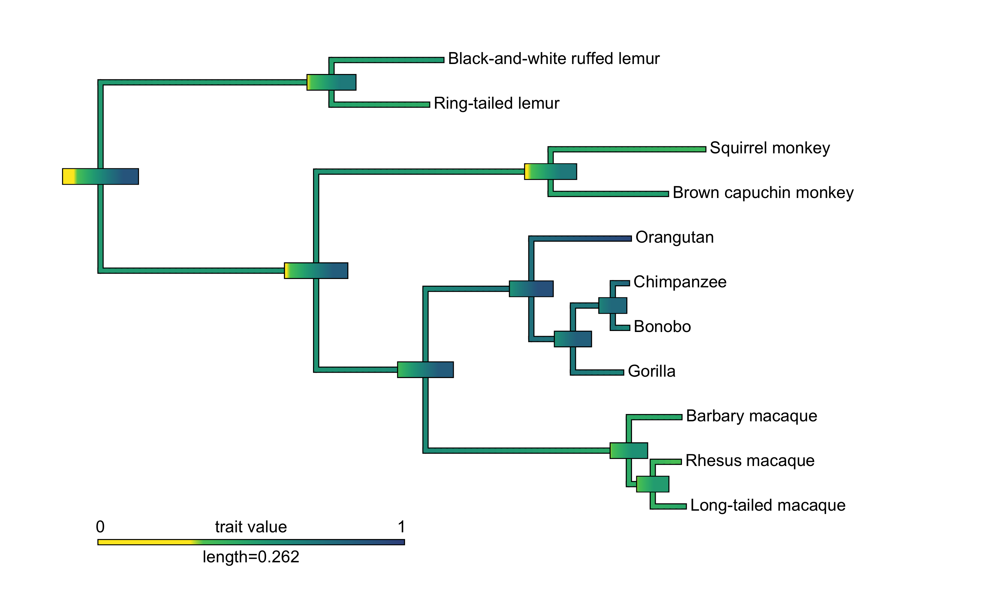

```{r, message=FALSE}
library(phytools)
library(tidyverse)
library(viridis)
library(colorspace) # for cvd_emulator
```

# Load pilot data and phylogenetic tree

exclude the lone spider monkey

```{r,message=FALSE}
species_data <- read_csv("../data/species_data.csv")
mp.tree <- read.nexus("../data/consensusTree_10kTrees_Primates_Version3.nex")
mp_data <- read.csv("../data/merged_data/01_manyprimates_pilot_merged_data_v2.csv") %>%
  filter(species != "black_faced_spider_monkey")
```

```{r}
temp <- tibble(label = mp.tree$tip.label) %>%
  left_join(species_data, by = c("label" = "species_latin"))
```

```{r}
mp.tree$tip.label <- temp$species_formatted
```

```{r}
# summary(mp.tree)
# head(mp.tree)
```

# Plot

```{r, fig.width=4, fig.height=2}
plotTree(mp.tree, type = "cladogram")
```

# Prepare test objects

<!-- Aggregate by delay: short, medium, long -->

```{r, eval=FALSE}
phylo.df <- mp_data %>%
  group_by(species, delay) %>%
  summarise(M = mean(correct), SD = sd(correct))
```

<!-- Aggregate across all delays, for average performance -->

```{r, eval=FALSE}
phylo.df.all <- mp_data %>%
  group_by(species) %>%
  summarise(M = mean(correct), SD = sd(correct))
```

Aggregate only across medium and long delays

```{r}
phylo.df.all <- mp_data %>%
  filter(delay != "short")%>%
  group_by(species) %>%
  summarise(M = mean(correct), SD = sd(correct))
```

```{r}
## uncomment these to run it for specific delay levels
# phylo.df.all <- filter(phylo.df, delay == "short")
# phylo.df.all <- filter(phylo.df, delay == "medium")
# phylo.df.all <- filter(phylo.df, delay == "long")
```

- replace common name with latin species name
- reorder rows/species to match order in phylogenetic tree

```{r, warning=FALSE}
phylo.df.all2 <- species_data %>%
  select(species, species_formatted, phylo4phylo) %>%
  left_join(phylo.df.all, ., by = "species") %>%
  arrange(phylo4phylo) %>%
  ungroup %>%
  select(species_formatted, everything(), -species, -phylo4phylo) %>%
  rename(species = species_formatted)
```

# Estimate lambda starting value in advance

a one sample t-test is just a paired t-test where the values are paired with the 0 vector

```{r}
phylo.table.all <- phylo.df.all2 %>%
  rename(Ha = M, Ha.SE = SD) %>%
  mutate(H0 = 1/3, H0.SE = 0) %>%
  select(-species) %>%
  as.matrix

rownames(phylo.table.all) <- phylo.df.all2$species
```

```{r}
(l.all <- phylosig(mp.tree, x = phylo.table.all[, "Ha"], test = T, method = "lambda"))
saveRDS(l.all, "07_lambda.rds")
```

# T-testing

```{r}
(t.all <- phyl.pairedttest(mp.tree,
                           x1 = phylo.table.all[, "Ha"], x2 = phylo.table.all[, "H0"],
                           se1 = phylo.table.all[, "Ha.SE"], se2 = phylo.table.all[, "H0.SE"],
                           lambda = l.all$lambda
                           ))

saveRDS(t.all, "07_t-tests.rds")
```

<!-- # Possible log-likelihood ratio tests -->

<!-- Trying to reproduce _ et al. (2010) -->

```{r, eval=FALSE}
# -2LL = log-likelihood ratio
# D is the test statistic, follows chi2 distrib under null?
LR.D <- abs(2*t.all$logL)
Ddf <- 1
(p.val <- 1 - pchisq(LR.D, Ddf, ncp = 0, lower.tail = T, log.p = F))
```

# Ancestral state reconstructions

```{r}
# phylo.diff <- phylo.table.all[, "Ha"] - 1/3
priMemAnc <- fastAnc(mp.tree, phylo.table.all[, "Ha"], CI = T)
```

## Estimated performance of ancestors M & 95% CI

- Overlap with 1/3 ~ not better-than-chance performance (on medium/long delay)

```{r, results="asis"}
priMemAnc.tab <- cbind(priMemAnc$ace, priMemAnc$CI95) %>% as.matrix
colnames(priMemAnc.tab) <- c("ace", "LL", "UL")
priMemAnc.tab %>% knitr::kable(digits = 2)
```

Node numbers for reference

```{r, fig.width=4, fig.height=2}
plotTree(mp.tree, type = "cladogram")
nodelabels(bg = "white", cex = .8)
```

# Basic contour map of ancestral states by color

*Note. This is raw performance now, not performance above chance. Any red in the CI still indicates not-above-chance. --jw*

```{r}
# make the color palette for the full range, then make the entire bottom 1/3 a uniform red
# pal <- colorRampPalette(RColorBrewer::brewer.pal(11, "RdYlGn"))(24)
# pal[1:8] <- pal[4]

# bottom 1/3 = uniform yellow
pal <- rev(viridis(32))[1:24]
pal[1:8] <- pal[1]
```

```{r}
# plot.contMap
```

```{r}
png("../graphs/07_ancestral_state.png", width = 10, height = 6, unit = "in", res = 300)

obj <- contMap(mp.tree, phylo.table.all[, "Ha"], plot = F, lims = c(0, 1), sig = 2)
obj <- setMap(obj, pal)
plot(obj, mar = c(1, 2.1, 2, 0), xlim = c(-.02, .75), ftype = "reg") #bltr
errorbar.contMap(obj)

dev.off()
```

```{r}
<<<<<<< HEAD
tiff("../graphs/Fig4.tiff", width = 10, height = 6, unit = "in", res = 300, type = "cairo", compression = "lzw")
=======
tiff("../graphs/Fig5.tiff", width = 10, height = 6, unit = "in", res = 300, type = "cairo", compression = "lzw")
>>>>>>> refs/remotes/origin/master

obj <- contMap(mp.tree, phylo.table.all[, "Ha"], plot = F, lims = c(0, 1), sig = 2)
obj <- setMap(obj, pal)
plot(obj, mar = c(1, 2.1, 2, 0), xlim = c(-.02, .75), ftype = "reg") #bltr
errorbar.contMap(obj)

dev.off()
```




```{r}
cvd_emulator("../graphs/07_ancestral_state.png")
```

