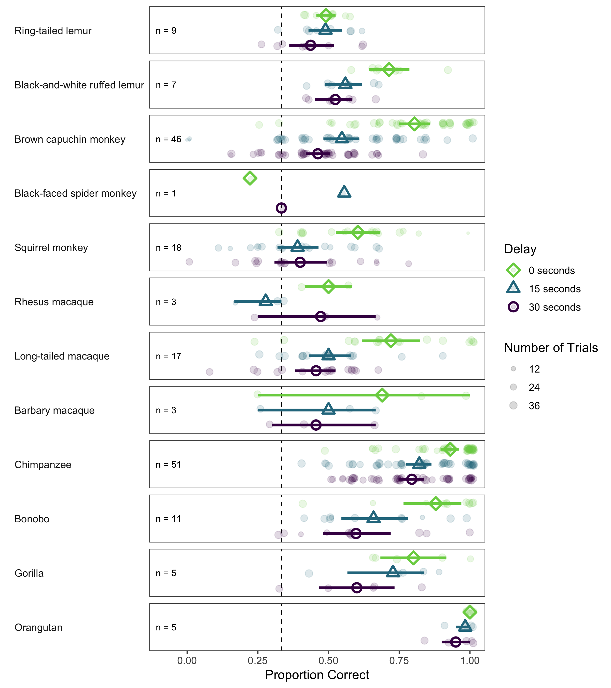
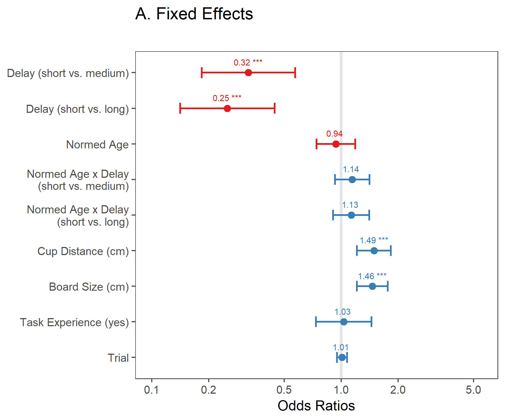
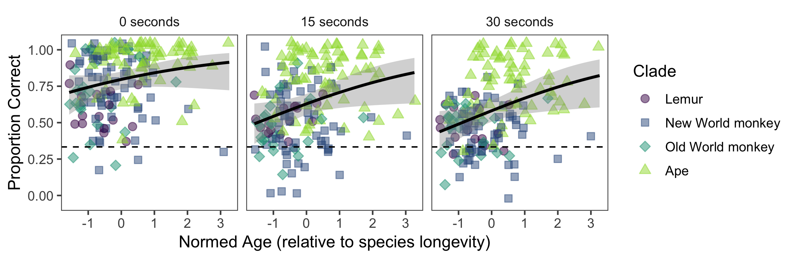
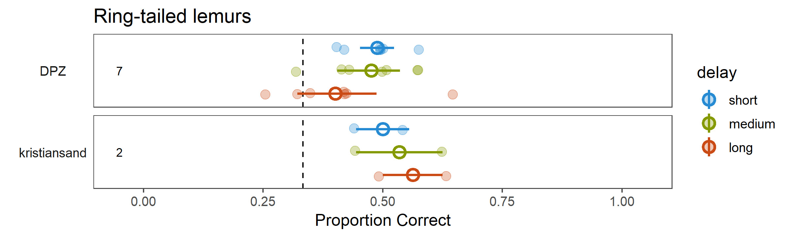
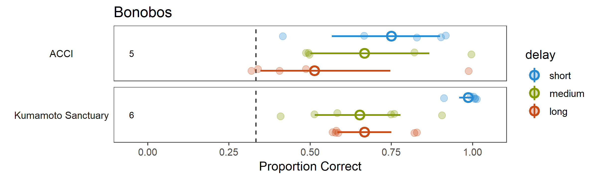
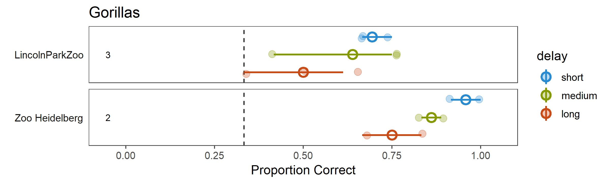
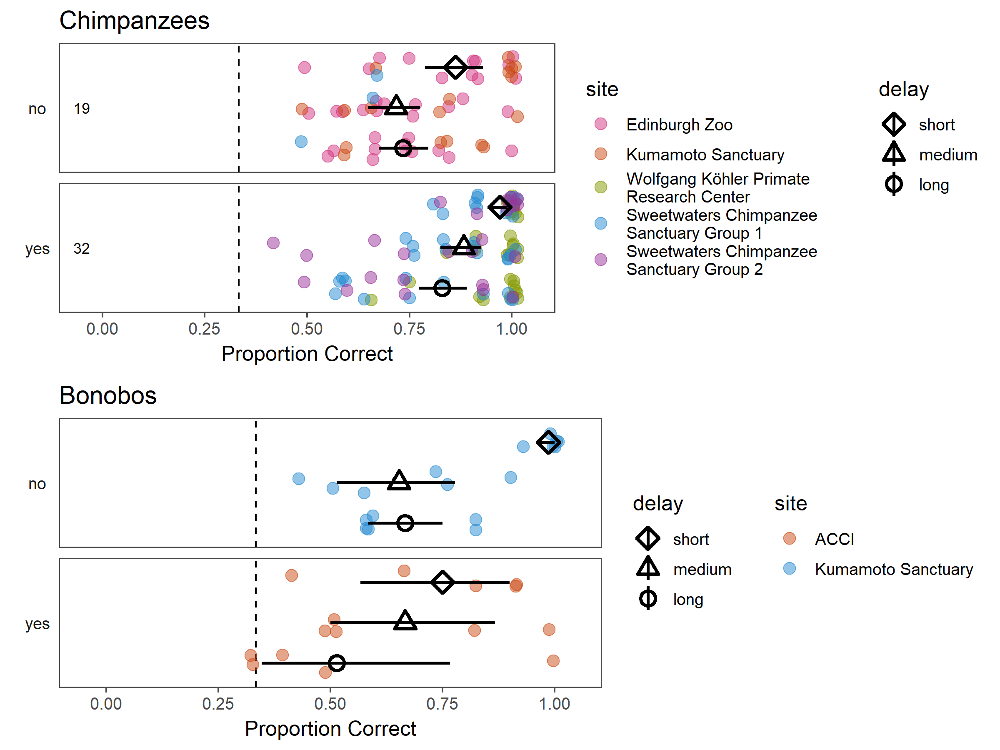

```{r setup, include=FALSE}
library(tidyverse)
library(knitr)
```

```{r loading data}
mp_data <- read.csv("../data/merged_data/01_manyprimates_pilot_merged_data_v2.csv")
```

## Descriptives 

Here is an overview of our sample. The size and diversity are impressive.

### Sample size

```{r descriptives overall, results="asis"}
mp_data %>%
  summarize(N = n_distinct(subject_site),
            Species = n_distinct(species),
            Sites = n_distinct(site) - 1) %>% # sweetwaters and sweetwaters_group2
  kable()
```

### Sample size by species

```{r descriptives by site and species, results="asis"}
mp_data %>%
  group_by(species) %>%
  summarize(N = n_distinct(subject_site),
            Sites = n_distinct(site)) %>%
  kable()
```

### Sites


## Visual overview

First an overview of the data, plotted by species and delay. Small, transparent dots represent aggregated data for each individual by delay. Solid dots are species means for a given delay. Error bars are 95% confidence intervals (CI). Dotted line represents level expected by chance. Performance is significantly different from chance, if the CI does not overlap with the chance line. 

Species are grouped by phylogeny, with lemurs on top, followed by new world monkeys, old world monkeys and apes.



## Inference: GLMM

The main purpose of the model is to test our two hypothesis:

1. Probability of correct choice decreases with delay length (main effect of delay)
2. Probability of correct choice decreases in older individuals in longer delays (interaction between age and delay)

The pre-registered model had the following structure

```
correct ~ delay * age +
          task_experience + cup_distance + board_size + trial +
          (1 + delay + trial | site/subject/block/hiding_location ) +
          (1 + task_experience + cup_distance + board_size + trial + delay | species)
```

Based on convergence issues and other considerations (see `05_mixed_model` file for details on the decision process) we modified the random effect structure and remove board size, which co-varied with cup distance. The reduced model has the following structure: 

```
correct ~ delay * norm_age + 
          task_experience + cup_distance + trial + 
          (1 + delay | site/subject_site) + 
          (1 + delay | species)
```

Variable names in the data frame:

* `subject_site = subject`
* `norm_age = age` divided by species longevity and scaled and centered across species

Below, we plot odds ratios for fixed effects. As a guideline for interpretation, errorbars that do not overlap with the vertical line indicate a significant effect in the model.



### Effect of delay

What we see is a significant effect of delay. The reference level is the short delay condition and performance in the long as well as in the medium condition are significantly worse compared to this. This suggests that, across species, performance decreases in the delay trials. This confirms the intuition one gets from looking at the summary plot above. In another model, not shown here, we tested if medium delay is also different from long delay and found that this was the case. This shows a graded retention effect across species. 

### Interaction of age and delay

No such interaction could be found in the model. Below we plot performance aggregated for each subject against age (regression line is smoothed conditional mean with 95% CI). This visualization confirms the statistical analysis. As part of the exploratory analysis, we might want to look for a quadratic or cubic relation between age, delay and performance.



### Effect of cup distance

We did not expect such an effect and looking at the data it is unlikely that cup distance in and of itself is driving this effect. Looking at the graph below, one can see that cup distance is confounded with species (presumably due to body size) and also site within species. This is effect is therefore likely a result of adjusting the test setup to site and species.


## Comparing sites

Here we select the species for which we have data from multiple sites. This is a rough way of checking whether there is a lot of variation between sites. Plotting conventions are the same as above.

Based on the table above, we have data from multiple sites for bonobos, chimpanzees, capuchins, gorillas and ring-tailed lemurs. The most informative plots will be the ones for chimpanzees and capuchins because there we have the largest sample size per site. 

We can compare absolute level of performance (in what range of correct proportions does the data across delays from each site fall) as well as relative (how do the delays compare to one another).

### Chimpanzees

Here we see that performance on an absolute level is fairly similar across sites. The Leipzig chimpanzees seem to perform better compared to the others, but this might be due to them being involved in a lot of studies using the same or a very similar setup.


### Ring-tailed lemurs

Again, the absolute level is similar across sites, but there are very few data from one site.



### Brown Capuchins

Here we have a decent sample size for both sites. Absolute and relative performance looks very similar. 


### Bonobos

Here we have relatively few data and therefore quite variable estimates. Performance looks more variable compared to the other species.



### Gorillas

Relative performance looks similar. The Lincoln Park gorillas did consistently worse than the Heidelberg gorillas, but there's little data for either site.



## Comparing across task-experience

Even though we did not find an overall effect of task experience in the model, it might be interesting to look at how subjects from one species with different levels of task experience perform. This only applies to chimpanzees and bonobos. However, task experience is confounded with site. In the plots below, the dots are colored according to site to visualize this.

### Chimpanzees

For the chimpanzees, the absolute level seems to be comparable with and without task experience. 

For the bonobos, this is redundant with the site plot above. 



## Phylogenetic analysis

The goal of the phylogenetic analysis is twofold: On the one hand, we want to estimate how strong the phylogenetic signal is in our data, and on the other hand, we want to make inferences about how short-term memory capacity evolved over time.

### Phylogenetic signal: $\lambda$

To answer the first question, we can look at "lambda" - $\lambda$, a single value for estimating the strength of the phylogenetic signal in the data. In a nutshell, $\lambda$ reflects whether species are as similar to one another as predicted by their shared evolutionary history. $\lambda$ ranges (in most cases) between 0 and 1, with 0 meaning no and 1 meaning a strong signal. There are also significance tests for lambda (likelihood ratio tests). For a relatively understandable introduction to how lambda is computed, we recommend looking at a paper by [Freckleton et al. (2002)](https://www.journals.uchicago.edu/doi/10.1086/343873). A slightly less technical description is also given in [MacLean et al. (2012)](https://link.springer.com/article/10.1007%2Fs10071-011-0448-8).

In our case, $\lambda$ can be estimated in two ways. First, we can do this based on the performance means alone. Second, it can be estimated as part of a phylogenetic t-test. This test is basically a one sample t-test that also recognizes that species might be more similar to one another due to their shared evolutionary history. The additional information that goes into the t-test is the standard deviation and the reference (chance) level. You can think of the first version as being something like a base $\lambda$ and the second version an updated $\lambda$.

To get more precise estimates for each species we aggregated the data across delays for this analysis. In principle, we could also repeat the analysis for each delay condition separately but we thought that the mean across delays reflects the overall level of short-term memory capacity in each species relatively well.

```{r}
l.all <- readRDS("07_lambda.rds")
t.all <- readRDS("07_t-tests.rds")

LR.D <- abs(2*t.all$logL)
Ddf <- 1
p.val <- 1 - pchisq(LR.D, Ddf, ncp = 0, lower.tail = T, log.p = F)
```

Here are the estimates for $\lambda$ based on our data:

Base $\lambda$ = `r round(l.all$lambda, 2)`, *p* = `r round(l.all$P, 3)`

Updated $\lambda$ = `r round(t.all$lambda, 2)`, *p* = `r round(p.val, 3)`

Just based on the numerical value of $\lambda$, it seems that there is a substantial phylogenetic signal in our data. That is, species that share a long evolutionary history tend to perform on a similar level. When updated, $\lambda$ is also significantly different from 0.

A word of caution: This analysis is preliminary because we do not have much experience with this measure. As we learn more, the results and approach taken might change.  

### Reconstruction of ancestral state

Based on our data, we can also model the short-term memory capacity of hypothetical common ancestors in the primate lineage. The goal of ancestral state reconstruction is to estimate the condition of phenotypic traits at internal branching points, or nodes, in the tree. So in the case of primate cognition, we are interested in how recently stronger aptitudes evolved, and where along the tree these adaptations occurred.

Ancestral state reconstructions and visualization is described in [Revell (2013)](https://besjournals.onlinelibrary.wiley.com/doi/abs/10.1111/2041-210X.12066), as well as in an R [tutorial](http://www.phytools.org/eqg2015/asr.html). 

The plot can be read based on the color of the branches. The range on the bottom of the graph shows the color scheme mapped onto performance (between 0 and 1). The more green a branch is, the higher the estimated short-term memory capacity. The rectangles at the nodes reflect the 95% CIs for a given common ancestor. If a CI includes some red, the estimated capacity is not different from 1/3 (chance).


A first interpretation of this plot would be that there is a common primate basis of short-term memory capacity. This capacity increases in the lineage leading up to great apes. 

*n.b.* As with the estimation of  $\lambda$, this analysis is preliminary. *P. t. verus* and *P. pygmaeus* were arbitrarily chosen as the representative species or subspecies of chimpanzees and orangutans. This was because detailed species and subspecies information was not available at this point in the study; the results were not affected by these decisions.


